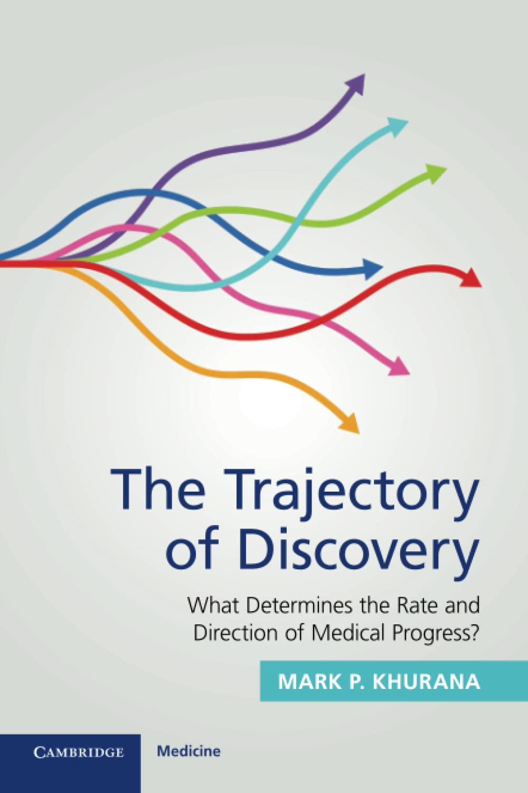

  
 <h3>The Trajectory of Discovery</h3> 
<strong>What Determines the Rate and Direction of Medical Progress?</strong>  <em>Mark P. Khurana, University of Copenhagen</em>  Published April 2023 • ISBN: 9781009354431
 
In this book, I explore why medical research progresses in the way it does — shaped by incentives, institutions, and choices about which scientific paths to follow. I bring together perspectives from policy, economics, sociology, and philosophy to explain both the rate and direction of discovery. I also reflect on challenges such as flawed incentive structures, lobbying, and the lack of novelty in drug development, while offering ideas for improving how we pursue progress in medicine.
 
 

  
 <h3>A Byte of Health</h3> 
<em>Health newsletter</em>
 
Together with colleagues, I co-author <em>A Byte of Health</em>, a biweekly newsletter that curates the latest breakthroughs in health and life science. We cover everything from AI models predicting disease decades in advance to new approaches in cancer treatment, neuroscience, and global health.
 
 

  
 <h3>Untold Health</h3> 
<em>Podcast</em>
 
I hosted <em>Untold Health</em> from 2019-2023, a podcast dedicated to exploring important but often overlooked issues in health. Through conversations and stories from Ukraine to India, I brought forward the hidden dynamics of health policy, medicine, and society.
 
 

